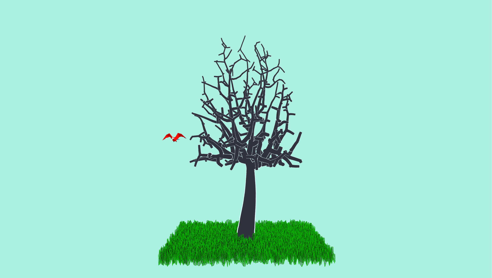
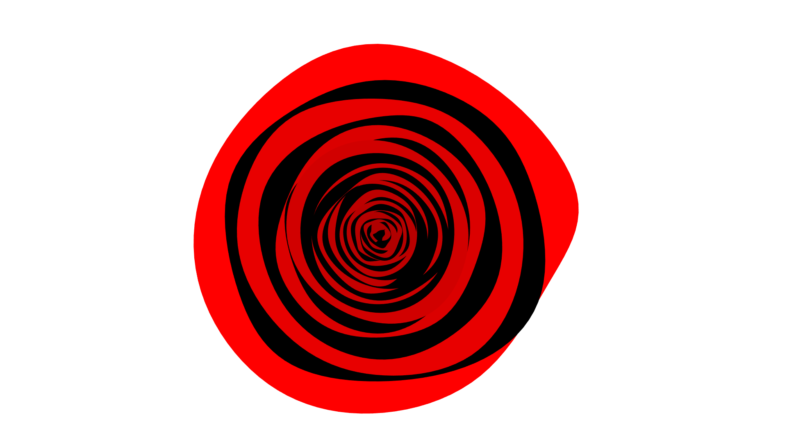
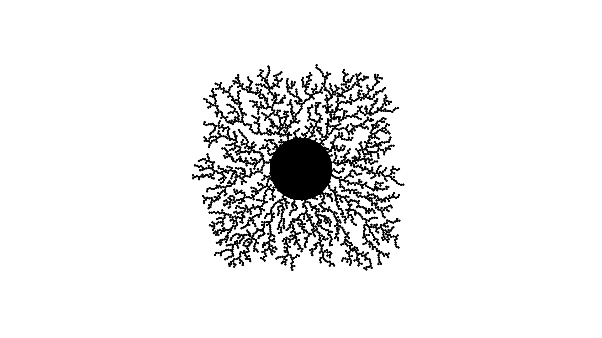
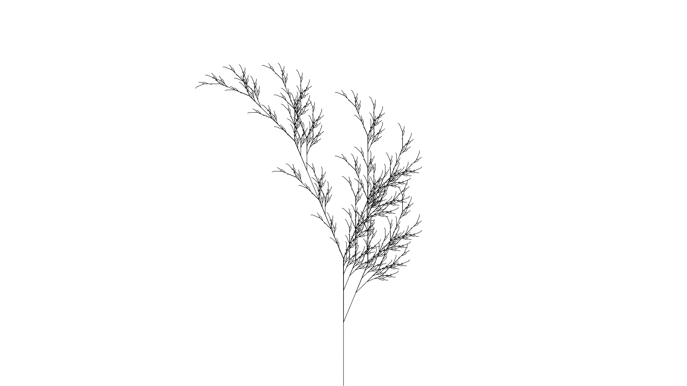
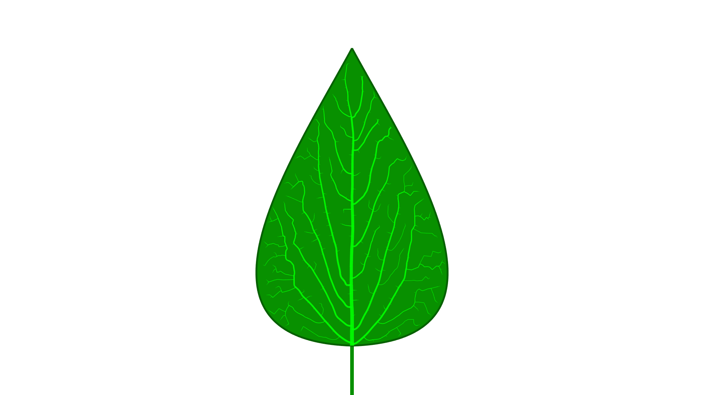
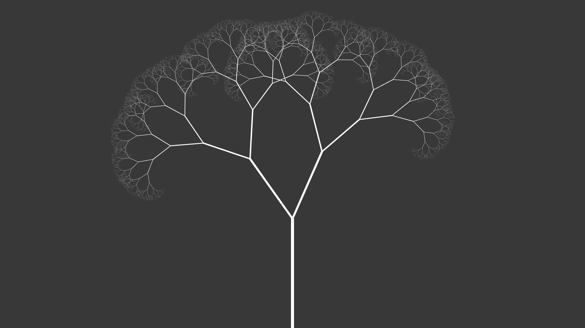
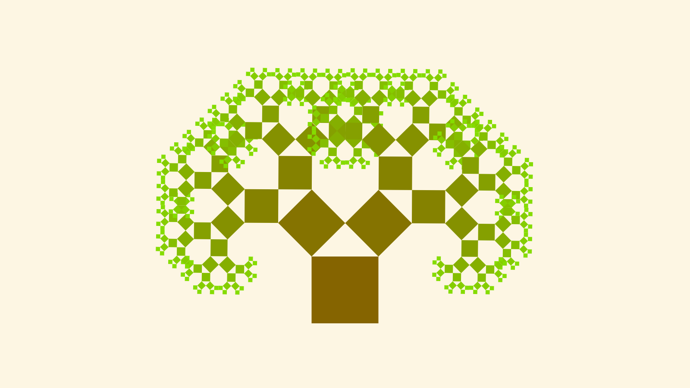

# Park
## Screenshots
### Space colonization

### Abstract SVG rose

### Diffusion limited aggregation

### L-system

### Phyllotaxis

### Leaf venation

### Fractal tree

### Pythagoras tree

## Misc
Inspired by the [collection of three.js sketches](https://github.com/ykob/sketch-threejs) by ykob, Daniel Shiffman's [algorithmic botany series](https://www.youtube.com/playlist?list=PLRqwX-V7Uu6bxNsa_3SfCPyF9Md9XvXhR) and [the algorithmic botany website](http://algorithmicbotany.org/).
